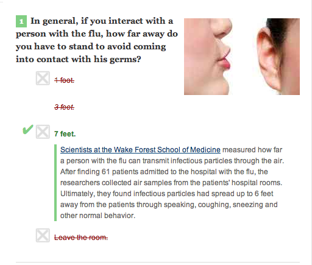
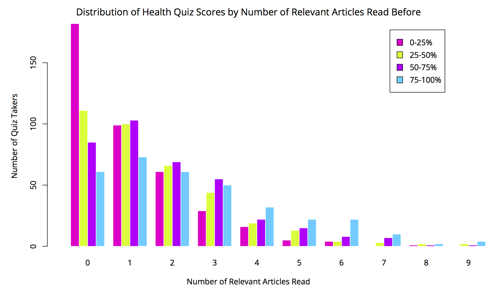
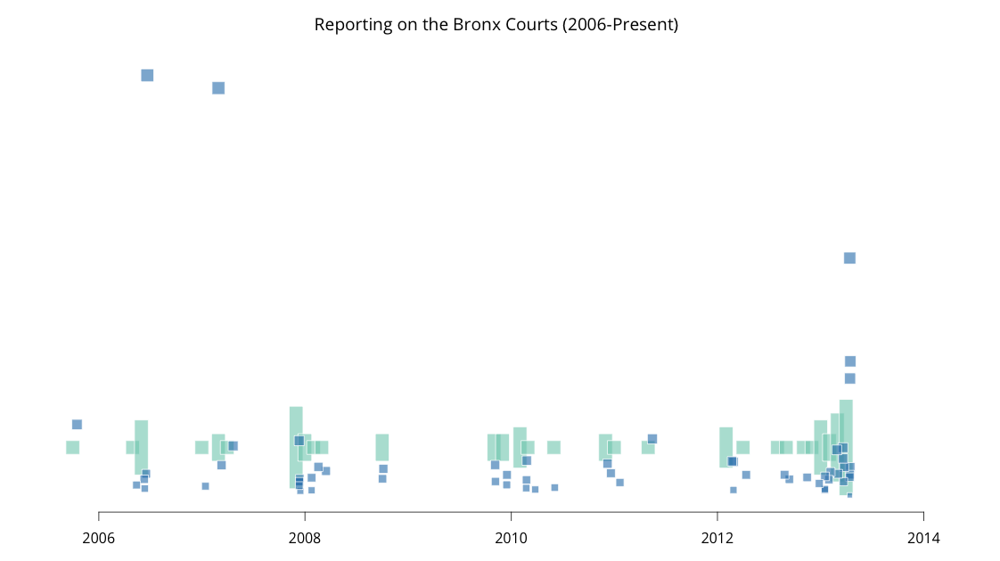

## Experiments in Impact Measurement
[Brian Abelson](http://brianabelson.com) Mozilla-Knight OpenNews Fellow _New York Times_

## [_“So, what if we measured journalism by its impact?”_](http://aronpilhofer.com/post/27993980039/the-right-metric-for-news)

_"The ideal outcome would be a suite of open-source tools, techniques and best practices that, in aggregate, help all of us understand readers better and enhance the impact of our journalism. At a bare minimum, we hope to start asking the right questions."_

## Quantifying engagement with News Apps

# 

# 

## Health quizzes

Albert Sun - Interactive Developer at the _New York Times_

## Homepage Model

## Bronx Courts

## Ecosystem of Stories

## Future
- Experimental manipulation of content.
- Embedding the collection of impact metrics into journalist workflows.

Thanks!